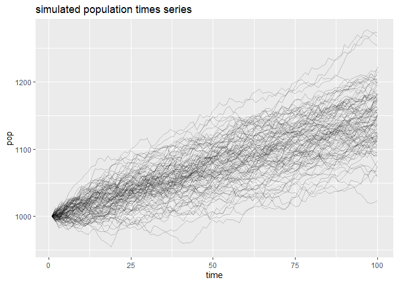
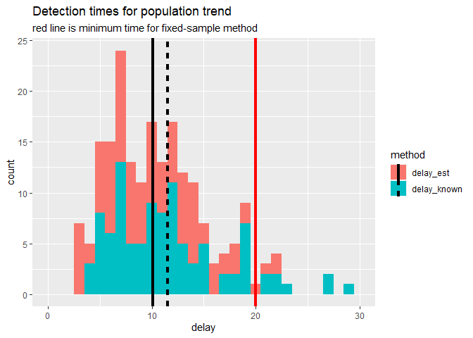

# Trend detection: sequential vs fixed sample approaches
Wildlife managers and conservationists need to detect population trends in a timely and reliable manner. Timeliness is reflected in the number of samples (e.g., years) needed to detect a trend. Reliability is captured by the type I error and power of a test. Simple linear regression using sampling time as a covariate is commonly used to detect population trends. Researchers have used this approach to identify the minimum years of monitoring needed to detect population trends.

For example, [White (2019)](https://academic.oup.com/bioscience/article/69/1/40/5195956#129750432) repeatedly fit linear models to sub-samples of a time series to identify the minimum sample size needed to achieve a specified type I error and power. That is, for a time series with $T$ time points, he fit a linear regression model to each contiguous sub-samples of size $2, 3, \ldots, T-1$. Using the arbitrary (but conventional) benchmark of 0.8 power at the 0.05 significance level, White used the regression outputs to find the minimum sub-sample length such that 80 % of the samples had a significant regression slope coefficient. This is essentially a sample size calculation for a one-sided hypothesis test with $H_0: r = 0$ and $H_1: r > 0$ or $H_1: r < 0$.

White used data simulated from the following population model for examples of how to calculate fixed-sample sizes needed to detect population trends,
$$ N_{t+1} \sim N(N_t + r,\sigma), $$
Where $N_t$ is the population size at time $t$, $r$ is the population trend, and $\sigma$ is the population variability.

We can also test this one-sided hypothesis using a sequential test. We can define our sequential test statistic at time $t$ $(S_t)$ as:

\begin{align*}
S_t &= \Sigma^{t}_{i=1}R_i & \text{for } t &= 1,2,3, \ldots\\
\text{and } R_1 &= 0 & R_t &= \log \left( \frac{P(N_{t} | N_{t-1}, \hat{r}_t, \sigma)}{P(N_{t} | N_{t-1}, r = 0, \sigma)} \right)
\end{align*}

$\hat{r}_t$ is the MLE of r computed from data points $X_1,\ldots,X_t$. The MLE is constrained to  $(0,\inf)$ or $(-\inf, 0)$ depending on whether detection of a linear increase or decrease is desired. (In my computer implementation, I just use a finite interval for the constrained MLE).

The decision rule is:

\begin{align*}
    \begin{cases}
      \text{reject } H_0  & S_t > \log(A) \\
      \text{accept } H_0 & S_t \leq \log(B) \\
      \text{continue sampling} & \log(B) < S_t  \leq  \log(A)  
    \end{cases}
\end{align*}

The thresholds are set following Wald's method such that $A \sim \frac{1-\beta}{\alpha}$ and $B \sim \frac{\beta}{1-\alpha}$ where $\alpha$ and $\beta$ is the probabilities of type I and II error, respectively (I'm not sure if these approximations work for this inference problem, I still need to check if these boundaries give the correct error probabilities).

For the situation where $\sigma$ is unknown, the sequential test statistic is instead calculated using the current ML estimate of of the standard deviation ($\hat{\sigma_t}$). $\hat{\sigma_t}$ is computed as a [running variance](https://www.johndcook.com/blog/standard_deviation/) from the first differences of the observations $N_t - N_{t-1} \overset{iid}{\sim} Norm(r,\sigma)$ for $t = 2,3,4,\ldots$. If we know that there is a lower bound on the variability of the population when it is stable we can use $\sigma_{t} = max \left( \sigma_{mle},\sigma_{min} \right)$.

# Comparison of detection times

Tests:

1. fixed-sample size linear regression test
1. sequential test ($\sigma$ known)
1. sequential test ($\sigma$ unknown)
    + the running MLE estimate of $\sigma$ is used to calculate the test statistic
    + note that the MLE estimate of $\sigma$ is uncorrected (biased low)

I compare the performance of the tests according to the time required to reject the null hypothesis that there is no population trend ($\alpha = 0.05, \beta=0.2$). The population data were simulated from an additive model $N_{t+1} = N(N_t + r,\sigma)$ with parameters $r =$ 1.5 and $\sigma =$ 5. The population was initialized as 1000 individuals and was run for 100 time steps. 100 simulations were used.

<!-- -->

The fixed-sample size needs 20 samples to achieve 0.8 power at the 0.05 significance level. In comparison, the sequential tests require 12 ($\sigma$ known) and 11 ($\sigma$ unknown and $\sigma_{min} =$ 3). The reason that the sequential test where $\sigma$ is unknown detects the change faster than when $\sigma$ is known (for the parameters used here) is because the MLE estimate of $\sigma$ is uncorrected which biases it low. This makes the likelihood of the null smaller than it should be. The table belows shows the number of instances either sequential method required as many or more samples than the fixed-sample size test.

|method      |delay >= samplesize |  n|
|:-----------|:-------------------|--:|
|delay_est   |FALSE               | 96|
|delay_est   |TRUE                |  4|
|delay_known |FALSE               | 92|
|delay_known |TRUE                |  8|

<!-- -->

Note, the probability models used for the fixed-sample and sequential tests are not the same. The sequential test uses the true data-generating model (variability is from process noise) whereas the fixed-sample test fits a simple linear regression using time as a covariate (observation noise). A more comparable test would be to use a sequential t-test on the first-differenced values of the population sizes. 

